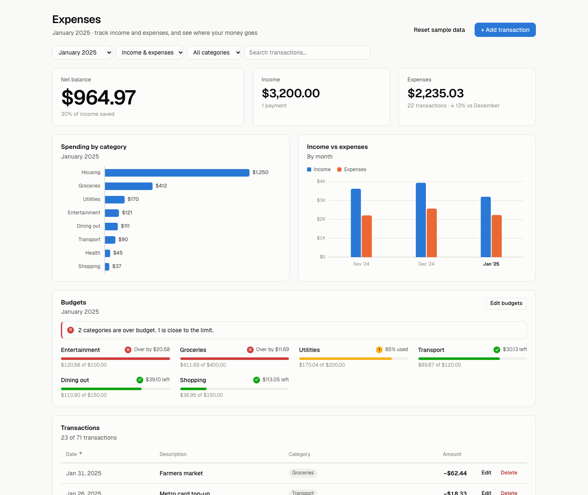
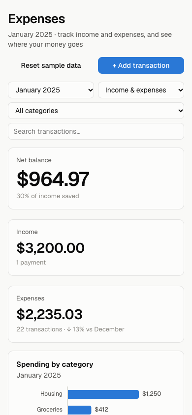
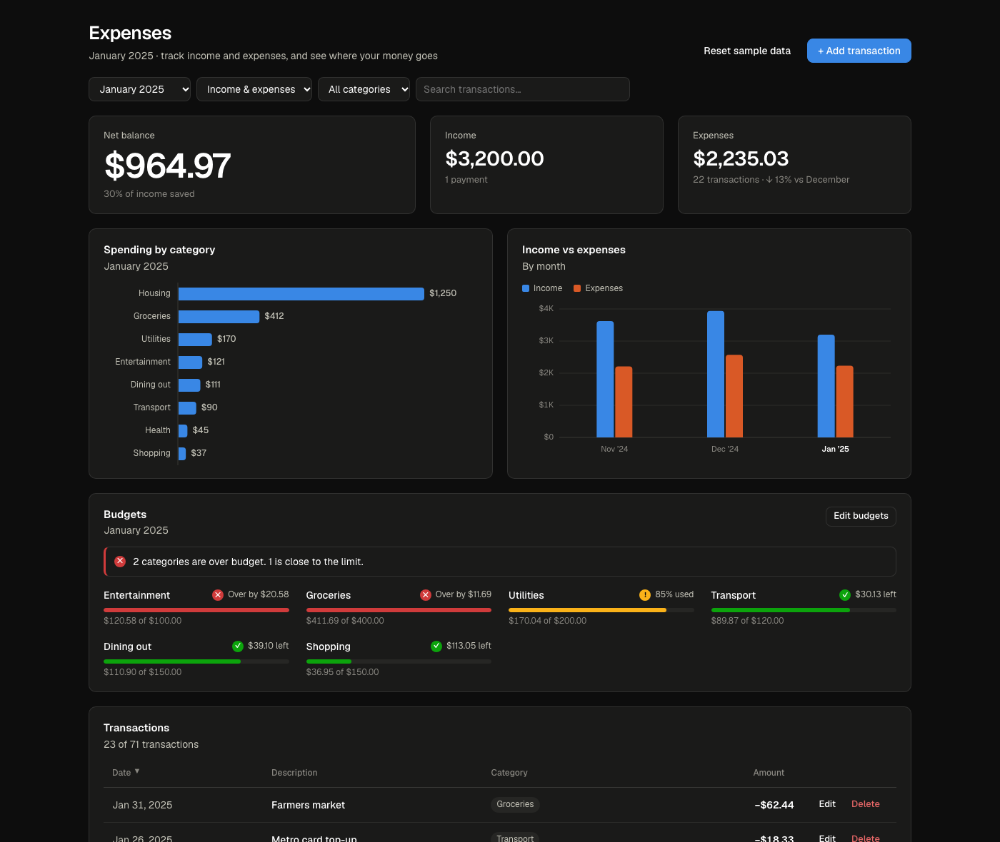

# Expense Tracker

A full-stack expense tracker built with Next.js and TypeScript. Log income and expenses, see where your money goes each month, and get warned before you blow a budget.



<p align="center">
  
</p>

<details>
<summary>Dark mode</summary>



</details>

## Features

- **Transactions**: add, edit and delete income and expenses, with validation in the form and on the server
- **Sortable list**: by date, description, category or amount
- **Search and filters**: by month, type (income or expense) and category, combined with text search
- **Monthly summary**: net balance, savings rate, income and expenses, with a month-over-month change
- **Charts**: spending by category and income vs expenses by month, with hover and keyboard tooltips
- **Budgets**: a monthly limit per category, with progress bars and alerts at 80% and when you go over
- **REST API**: Next.js Route Handlers backed by a JSON file, with server-side validation
- **Loading and error states**: a loading indicator, a clear error with a retry button, and inline errors when a save fails
- **Responsive design**: the transaction table becomes stacked cards on phones, with its own sort control
- **Light and dark mode**, following your system setting
- **Accessible**: status is always shown with an icon and a label (never colour alone), charts are keyboard-focusable, and dialogs use the native `<dialog>` element

## Tech stack

- [Next.js 16](https://nextjs.org/) (App Router, Route Handlers)
- [React 19](https://react.dev/) + [TypeScript](https://www.typescriptlang.org/)
- Plain CSS with custom properties, and hand-drawn SVG charts (no UI or chart library)
- [Geist](https://vercel.com/font) font via `next/font`

## Getting started

You need [Node.js](https://nodejs.org/) 20.9 or newer.

```bash
git clone https://github.com/chukuwyemokumbor/expenses-tracker.git
cd expenses-tracker
npm install
npm run dev
```

Then open http://localhost:3000.

### Scripts

| Command | What it does |
| --- | --- |
| `npm run dev` | Starts the development server |
| `npm run build` | Builds for production |
| `npm start` | Runs the production build |
| `npm run lint` | Runs ESLint |
| `npm run db:reset` | Restores the sample transactions and budgets |

### Data

The app comes with three months of sample data (November 2024 to January 2025). On first request, the API copies `data/seed.json` to `data/db.json` and saves your changes there. `db.json` is ignored by git. You can restore the sample data with the **Reset sample data** button or `npm run db:reset`.

> The JSON file storage is meant for running locally. Serverless hosts like Vercel don't keep files between requests, so for a real deployment, replace `src/lib/server/db.ts` with a database.

## API

| Method | Endpoint | Description |
| --- | --- | --- |
| `GET` | `/api/transactions` | List all transactions |
| `POST` | `/api/transactions` | Create a transaction |
| `PUT` | `/api/transactions/:id` | Replace a transaction |
| `DELETE` | `/api/transactions/:id` | Delete a transaction |
| `GET` | `/api/budgets` | Get monthly budgets |
| `PUT` | `/api/budgets` | Replace monthly budgets |
| `POST` | `/api/reset` | Restore the sample data |

A transaction looks like this:

```json
{
  "id": "sample-1",
  "type": "expense",
  "amount": 59.99,
  "category": "Utilities",
  "description": "Internet",
  "date": "2025-01-18"
}
```

Budgets are a map of expense category to monthly limit, e.g. `{ "Groceries": 400, "Dining out": 150 }`.

Invalid requests get a `400` with a message, e.g. `{ "error": "amount must be a number greater than zero." }`.

## Project structure

```
data/
└── seed.json               Sample transactions and budgets
scripts/
└── reset-db.mjs            Restores data/db.json from the seed
src/
├── app/
│   ├── api/                Route Handlers: transactions, budgets, reset
│   ├── globals.css         Colour tokens (light and dark) and all styles
│   ├── layout.tsx
│   └── page.tsx
├── components/             Tracker UI: list, form, charts, budgets, dialogs
├── hooks/                  useTransactions, useBudgets, useElementWidth
├── lib/
│   ├── server/db.ts        JSON file storage with serialised writes
│   ├── api.ts              Client for the REST API
│   ├── budget.ts           Budget progress and status
│   ├── categories.ts       Income and expense categories
│   ├── format.ts           Money, date and month helpers
│   └── validate.ts         Request validation shared by the API routes
└── types/
    └── transaction.ts      Transaction and budget types
```
